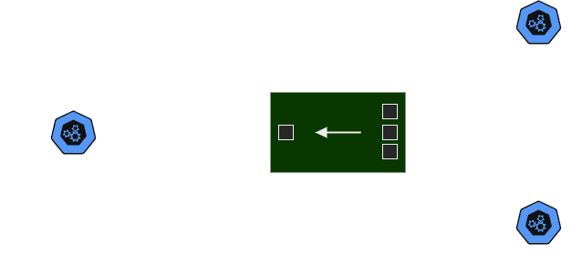

# Index

1. [Aggregator Service Overview](#aggregator-service)
2. [List of Used Libraries and Their Purposes](#list-of-used-libraries-and-their-purposes)
   - [Runtime Dependencies](#runtime-dependencies)
   - [Development Dependencies](#development-dependencies)
3. [Getting Started](#getting-started)
   - [Prerequisites](#prerequisites)
   - [How to Get API Keys and Store Them in the Database](#how-to-get-api-keys-and-store-them-in-the-database)
4. [Setup and Installation](#setup-and-installation)
5. [Generic Schema](#generic-schema)
6. [API Requests Using cURL](#api-requests-using-curl)
   - [Get All Issues (GitHub + GitLab)](#get-all-issues-github--gitlab)
   - [Get All Issues from Specific Source (GitHub)](#get-all-issues-from-specific-source-github)
   - [Get One Issue](#get-one-issue)
   - [Create an Issue](#create-an-issue)
   - [Update an Issue](#update-an-issue)
   - [Delete an Issue](#delete-an-issue)
7. [Postman Collection](#postman-collection)
8. [Troubleshooting](#troubleshooting)
   - [Backend Fails to Connect to Database on Startup](#backend-fails-to-connect-to-database-on-startup)
   - [Initial Migration Fails Due to Database Delay](#initial-migration-fails-due-to-database-delay)

# Aggregator Service

The Aggregator Service is a scalable and containerized Node.js backend built to manage and aggregate issue APIs from GitHub and GitLab through a unified GraphQL interface. Developed with TypeScript and Docker, this service simplifies the process of interacting with issue data across both platforms, offering flexibility for future API integrations.

## Overview



This service aggregates external APIs (GitHub GraphQL and GitLab APIs) and exposes them through a single GraphQL interface specifically for managing issues. The goal is to provide a unified way for consumers to query, create, update, and delete issues from GitHub and GitLab, using a scalable and containerized backend service.

### Key features:

- Exposes GitHub and GitLab issue management APIs via GraphQL.
- Handles GraphQL requests to aggregate and manipulate issue data from both platforms.
- Stores API credentials securely in a PostgreSQL database.
- Easily extendable to integrate issue APIs from new platforms in the future.

## List of Used Libraries and Their Purposes

### Runtime Dependencies

- **apollo-server**  
  _Purpose_: Provides a framework to build a GraphQL server. It handles incoming GraphQL queries, validates them, and sends back responses.

- **axios**  
  _Purpose_: A popular HTTP client for making requests to external APIs, such as GitHub and GitLab. It is used for interacting with external services in your aggregator.

- **dotenv**  
  _Purpose_: Loads environment variables from a `.env` file into `process.env`, allowing you to configure your application (like database credentials, API tokens) without hardcoding them.

- **graphql**  
  _Purpose_: The core GraphQL JavaScript library that powers the GraphQL API. It defines the schema and query execution.

- **graphql-request**  
  _Purpose_: A lightweight GraphQL client used to make GraphQL requests to external APIs, such as GitHub and GitLab.

- **inversify**  
  _Purpose_: A powerful and flexible Inversion of Control (IoC) container for TypeScript. It’s used for dependency injection, helping to manage class dependencies and organize code.

- **type-graphql**  
  _Purpose_: A library that simplifies building GraphQL APIs with TypeScript by generating the schema from TypeScript classes and decorators.

- **typeorm**  
  _Purpose_: A TypeScript ORM (Object-Relational Mapper) for interacting with relational databases like PostgreSQL. It simplifies database queries and migrations.

- **winston**  
  _Purpose_: A logging library that allows structured and customizable logging for your application. It’s used to log application events and errors.

### Development Dependencies

- **ts-node**  
  _Purpose_: A TypeScript execution environment for Node.js. It allows running TypeScript files directly without compiling them first.

- **typescript**  
  _Purpose_: The core TypeScript language support that provides static typing for JavaScript and is used to compile TypeScript files to JavaScript.

## Getting Started

Follow the instructions below to build, run, and test the Aggregator Service locally.

## Prerequisites

- API tokens.
- Docker and Docker Compose installed.
- Node.js and npm installed.

### How to Get API Keys and Store Them in the Database

To use the Aggregator Service, you'll need API keys for GitHub and GitLab to interact with their respective APIs. Below are the steps to obtain the API keys and store them securely in the PostgreSQL database:

#### 1. Get GitHub API Token

1. Navigate to [GitHub Personal Access Tokens](https://github.com/settings/tokens).
2. Click on **Generate new token**.
3. Select the required scopes based on your needs (for managing issues, you may need the `issues` scope).
4. Copy the generated token.

#### 2. Get GitLab API Token

1. Navigate to [GitLab Personal Access Tokens](https://gitlab.com/-/user_settings/personal_access_tokens).
2. Create a new token with the necessary permissions (for managing issues, you may need the `issues` scope).
3. Copy the generated token.

#### 3. Store API Keys in the Database

Once you have both the GitHub and GitLab API tokens, you need to store them in the database. The service uses a **migration** to set up the required `credentials` table.

##### Running the Migration

To set up the table for storing API keys and endpoints, follow these steps:

1. The migration file will create a `credentials` table in your PostgreSQL database. The table will have the following structure:

   - `id`: A unique identifier for the record.
   - `source`: The source of the token (e.g., GitHub or GitLab).
   - `token`: The API token for the respective source.
   - `endpoint`: The API endpoint for the respective source.

2. The migration will automatically insert seed data into the `credentials` table with the provided GitHub and GitLab tokens and endpoints.

#### Migration Code Example

Here is the code used for the migration [create-credentials.ts](migrations/versions/1743727942854-create-credentials.ts):

```typescript
import { MigrationInterface, QueryRunner } from "typeorm";

export class CreateCredential1743727942854 implements MigrationInterface {
  public async up(queryRunner: QueryRunner): Promise<void> {
    await queryRunner.query(`
      CREATE TABLE "credentials" (
        "id" SERIAL PRIMARY KEY,
        "source" VARCHAR(255) NOT NULL,
        "token" VARCHAR(512) NOT NULL,
        "endpoint" VARCHAR(512) NOT NULL
      );
    `);

    await queryRunner.query(`
      INSERT INTO "credentials" ("source", "token", "endpoint")
      VALUES
        ('github', '<token>', 'https://api.github.com/graphql'),
        ('gitlab', '<token>', 'https://gitlab.com/api/graphql')
    `);
  }

  public async down(queryRunner: QueryRunner): Promise<void> {
    await queryRunner.query(`DROP TABLE "credentials"`);
  }
}
```

### Setup and Installation

1. Clone the repository:

   ```bash
   git clone https://github.com/JayankaSJ/aggregator-service.git
   cd aggregator-service

   docker-compose build
   docker-compose up
   ```

2. Execute Docker Commands:

   ```bash
   docker-compose build
   docker-compose up
   ```

## Generic Schema

```graphql
# Query to fetch all issues from a repository
type Query {
  # Fetches all issues from a specified repository and platform
  issues(
    namespace: String! # Platform/owner/namespace (GitHub/GitLab)
    repository: String! # Repository name
    source: String # Platform (GitHub/GitLab, optional)
  ): [Issue] # Returns a list of issues
}

# Query to fetch a specific issue by its ID
type Query {
  # Fetches a single issue by its ID
  issue(
    namespace: String! # Platform/owner/namespace (GitHub/GitLab)
    repository: String! # Repository name
    source: String! # Platform (GitHub/GitLab)
    id: String! # Issue ID
  ): Issue # Returns a single issue
}

# Mutation to create a new issue in a repository
type Mutation {
  # Creates a new issue in a repository
  create(
    namespace: String! # Platform/owner/namespace (GitHub/GitLab)
    repository: String! # Repository name
    source: String! # Platform (GitHub/GitLab)
    input: CreateIssue! # Issue data (title, description)
  ): Issue # Returns the created issue
}

# Mutation to update an existing issue
type Mutation {
  # Updates an issue by ID in a repository
  update(
    namespace: String! # Platform/owner/namespace (GitHub/GitLab)
    repository: String! # Repository name
    source: String! # Platform (GitHub/GitLab)
    id: String! # Issue ID
    input: UpdateIssue! # Updated issue data
  ): Issue # Returns the updated issue
}

# Mutation to delete an issue from a repository
type Mutation {
  # Deletes an issue by ID in a repository
  delete(
    namespace: String! # Platform/owner/namespace (GitHub/GitLab)
    repository: String! # Repository name
    source: String! # Platform (GitHub/GitLab)
    id: String! # Issue ID
  ): Boolean # Returns true if deletion was successful
}
```

## API Requests Using cURL

Here are the cURL commands to interact with the Aggregator Service's GraphQL endpoints.

1. Get All Issues (GitHub + GitLab)

   ```bash
   curl -X POST http://localhost:4000/ \
   -H "Content-Type: application/json" \
   -d '{"query": "query { issues(namespace: \"jayanka-dev\", repository: \"technical-test\") { id title source description } }"}'
   ```

2. Get All Issues from speccific source (github)

   ```bash
   curl -X POST http://localhost:4000/ \
   -H "Content-Type: application/json" \
   -d '{"query": "query { issue(namespace: \"jayanka-dev\", repository: \"technical-test\", source: \"github\", id: \"1\") { id title source description } }"}'
   ```

3. Get One Issue

   ```bash
   curl -X POST http://localhost:4000/ \
   -H "Content-Type: application/json" \
   -d '{"query": "query { issue(namespace: \"jayanka-dev\", repository: \"technical-test\", source: \"github\", id: \"1\") { id title source description } }"}'
   ```

4. Create an Issue

   ```bash
   curl -X POST http://localhost:4000/ \
   -H "Content-Type: application/json" \
   -d '{"query": "mutation { create(namespace: \"jayanka-dev\", repository: \"technical-test\", source: \"github\", input: { title: \"Updated Issue Title\", description: \"Updated issue description\" }) { id title description } }"}'
   ```

5. Update an Issue

   ```bash
   curl -X POST http://localhost:4000/ \
   -H "Content-Type: application/json" \
   -d '{"query": "mutation { update(namespace: \"jayanka-dev\", repository: \"technical-test\", source: \"github\", id: \"1\", input: { title: \"New Issue Title\", description: \"New issue description\" }) { id title source description } }"}'
   ```

6. Delete an Issue

   ```bash
   curl -X POST http://localhost:4000/ \
   -H "Content-Type: application/json" \
   -d '{"query": "mutation { delete(namespace: \"jayanka-dev\", repository: \"technical-test\", source: \"github\", id: \"4\") }"}'
   ```

#### Postman Collection

The Postman collection used for testing the aggregator service is included in the [aggregator-service.postman_collection](docs/collections/aggregator-service.postman_collection.json) directory. You can import the collection into Postman for easy testing of the service's endpoints.

## Troubleshooting

#### 1. Backend Fails to Connect to Database on Startup (Database Delay)

**Issue**:  
If the database takes longer to start than expected, the backend service will attempt to connect to the database too early. As a result, it will fail to connect and subsequently shut down.

**Solution**:

- Manually start the backend after it has been killed by Docker.
  1. Open the Docker console.
  2. Restart the backend container using the following command:
     ```bash
     docker start <backend-container-name>
     ```
  3. After the backend is started, it will attempt to reconnect to the database and continue running normally.

#### 2. Initial Migration Fails Due to Database Delay

**Issue**:  
When the database is delayed, the backend will attempt to run the initial migration on startup. If the database is not yet available, the migration will fail, causing the backend to shut down.

**Solution**:

- Manually drop the database in Docker and restart the whole container.
  1. Stop the Docker containers:
     ```bash
     docker-compose down
     ```
  2. Remove the database container to reset the state:
     ```bash
     docker volume rm <database-volume-name>
     ```
  3. Restart all containers with the following command:
     ```bash
     docker-compose up --build
     ```
  4. This will recreate the database and trigger the initial migration successfully.
